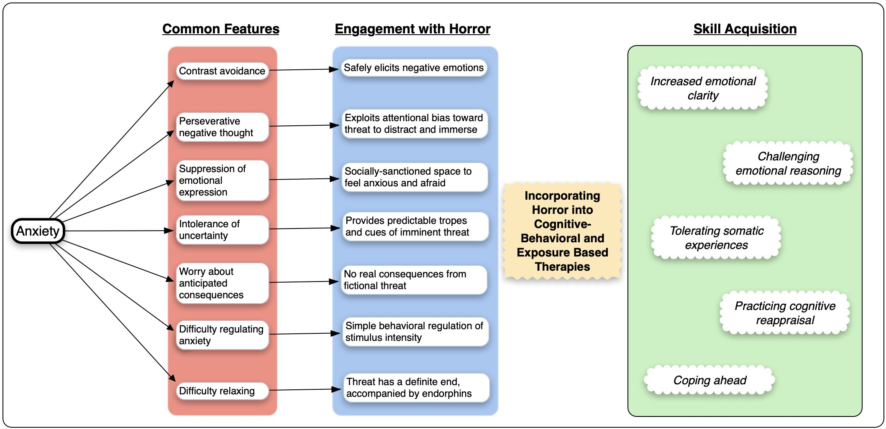
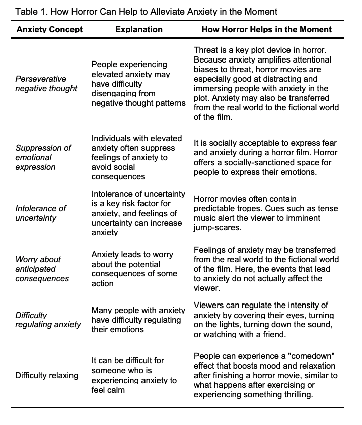
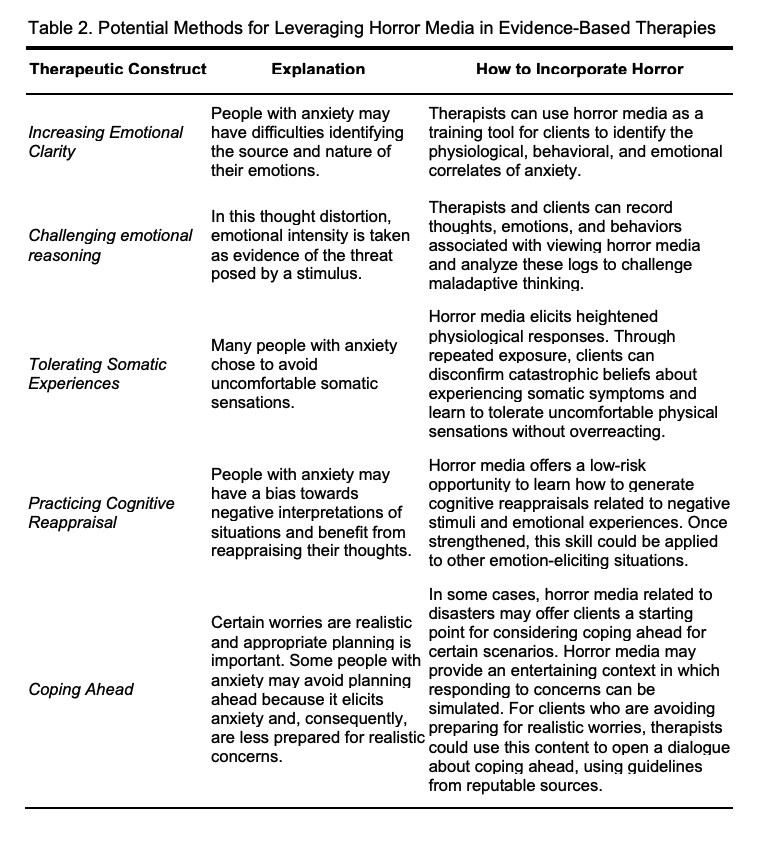

---
authors:
- admin
date: "2021-02-04T00:00:00Z"
external_link:
image: featured.jpg
  caption:
  focal_point: Smart
summary: Can horror be good for you?
tags:
- curiosity
- death
- violence
title: Horror and Mental Health
weight: 1
url_code: ""
url_pdf: ""
url_slides: ""
url_video: ""
external_link: ""
---

  

### Can horror be good for you?

Horror has been around as long as storytelling itself. Scary stories offered insight into the dangers of the world for our ancestors. Though it began as oral stories, modern horror pervades pop culture through literature, movies, TV shows, video games, and interactive theater. However, horror fandom comes with a stigma - the genre is often seen as "low-brow" entertainment with few if any redeeming qualities. However, I think horror has been underestimated. It's one of the few genres that shows us, unabashedly, the darker sides of existence. It provides us a safe place to face our fears and expeirence emotions such as fear and anxiety that we otherwise try to ignore. In fact, my research suggests that horror is not only not bad for you, but it might actually provide some benefits. 

The first part of this project has focused on the role of horror in anxiety. Despite the fact that horror aims to elicit fear and anxiety in its audience, many horror fans claim to have high anxiety. Some even say that horror helps them cope with their anxiety. As a first step in investigating this pheonomenon, I teamed up with [Kara Christensen](http://www.karachristensen.com) to write a theoretical article on how horror might help people cope with feelings of anxiety in the moment and how it might be incorporated into therapeutic contexts to build emotion regulation skills and resilience in more generalized situations. Some of our ideas are summarized in the figure and tables below. You can  find a preprint of our theoretical paper [here](https://psyarxiv.com/7uh6f/). If you're short on time, [this piece](https://nautil.us/issue/95/escape/why-horror-films-are-more-popular-than-ever) I wrote for Nautilus sums up the basic argument. Some of our ideas are also summarized in the figure and tables below.

  

  

### Relevant manuscripts

[Scaring Away Anxiety: Therapeutic Avenues for Horror Fiction to Enhance Treatment for Anxiety Symptoms](https://psyarxiv.com/7uh6f/).

[Pandemic Practice: Horror Fans and Morbidly Curious Individuals Are More Psychologically Resilient During the COVID-19 Pandemic](https://www.ncbi.nlm.nih.gov/pmc/articles/PMC7492010/)

