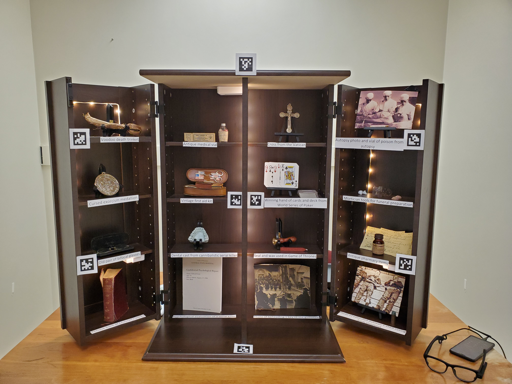

---
authors:
- admin
date: "2019-01-01T00:00:00Z"
external_link:
image:
  caption:
  focal_point: Smart
summary: What is morbid curiosity?
tags:
- curiosity
- death
- violence
title: The Psychology of Morbid Curiosity
weight: 2
url_code: ""
url_pdf: ""
url_slides: ""
url_video: ""
external_link: ""
---

  

### What is morbid curiosity?

Are you curious about what Gladiatorial fights in the Coliseum of Ancient Rome were like? Have you ever wondered how an autopsy is performed? Would you watch a documentary about a famous serial killer? If there was a supposedly haunted place in your city, would you be tempted to visit? Most people would answer yes to at least one of these questions. But why are people curious about phenomena that might be classified as morbid? 

Though there is no formal definition, morbid curiosity is typically described as an interest in or curiosity about unpleasant things, especially death. The commercial success of horror films, popularity of true crime television shows, and prevalence of violence in the news implies that the average person possesses some degree of morbid curiosity. Likewise, the presence of death-related phenomena in literature and art and the historical attraction of public executions and gladiatorial fights suggests that morbid curiosity is an old and cross-cultural phenomenon. Despite the ubiquity of morbid material in entertainment, research on morbid curiosity is largely absent from the psychological literature. Moreover, no well-validated scale exists to measure individual differences in morbid curiosity. In this research project, I am investigating the psychological nature of morbid curiosity. This includes the development and validation of the Morbid Curiosity Scale (MCS), evaluating its ability to predict behavioral outcomes, and assessing its relationship with personality. 

  

### Select media coverage

My work on morbid curiosity has been covered by a wide variety of news and media outlets, some of which include [New Scientist](https://www.newscientist.com/article/2247744-horror-movie-fans-are-better-at-coping-with-the-coronavirus-pandemic/), [National Geographic](https://www.nationalgeographic.com/science/2020/10/how-horror-movies-can-help-overcome-trauma-and-relieve-stress/), [The Chicago Tribune](https://www.chicagotribune.com/entertainment/ct-ent-morbid-curiosity-research-uchicago-20201014-l6br33nmrvffzmcpyndqbjfhqu-story.html), [The Guardian](https://www.theguardian.com/science/2020/jul/01/end-of-the-world-as-we-know-it-fans-of-apocalyptic-films), [The New York Times](https://www.nytimes.com/2020/08/20/movies/scary-movies-summer.html), [Forbes](https://www.forbes.com/sites/mishagajewski/2021/01/12/did-watching-all-those-zombie-movies-prepare-you-for-the-pandemic-research-says-yes/?sh=2cecdd134f15), [Nautilus](http://nautil.us/issue/87/risk/horror-fans-have-more-fun-during-a-pandemic), [Vice](https://www.vice.com/en_ca/article/5dzvez/horror-movie-fans-are-more-equipped-to-deal-with-the-pandemic-study-says), [Psycom](https://www.psycom.net/scary-movies-anxiety), and [Dread Central](https://www.dreadcentral.com/news/332315/new-study-reveals-horror-fans-coping-with-covid-19-pandemic-better-than-the-average-person/)

For a more in-depth discussion of my work on morbid curiosity, check out [my profile in the Chicago Tribune](https://www.chicagotribune.com/entertainment/ct-ent-morbid-curiosity-research-uchicago-20201014-l6br33nmrvffzmcpyndqbjfhqu-story.html).

  

### Interested in using the Morbid Curiosity Scale?
[Click here](https://coltanscrivner.com/files/Morbid_Curiosity_Scale_instructions.pdf") to download the Morbid Curiosity Scale and see how to use it. Please cite the [Psychology of Morbid Curiosity paper](https://psyarxiv.com/xug34/) if you use the scale.

### How morbidly curious are you?
If you want to see how morbidly curious you are, [click here](https://ssd.az1.qualtrics.com/jfe/form/SV_9GLAOrmsjMfthg9) to take the Morbid Curiosity Scale!

  

### Relevant manuscripts

[The Psychology of Morbid Curiosity: Development and Initial Validation of the Morbid Curiosity Scale](https://psyarxiv.com/xug34/).

[Pandemic Practice: Horror Fans and Morbidly Curious Individuals Are More Psychologically Resilient During the COVID-19 Pandemic](https://www.ncbi.nlm.nih.gov/pmc/articles/PMC7492010/)

[Scaring Away Anxiety: Therapeutic Avenues for Horror Fiction to Enhance Treatment for Anxiety Symptoms](https://psyarxiv.com/7uh6f/)

[An Infectious Curiosity: Morbid Curiosity and Media Preferences During a Pandemic](https://esiculture.com/an-infectious-curiosity-morbid-curiosity-and-media-preferences-during-a-pandemic)

  

### Cabinet of Curiosities

Below is a cabinet of curiosities I curated to test some ideas about morbid curiosity. While wearing [Pupil Invisible mobile eye tracking glasses](https://pupil-labs.com/products/invisible/), participants inspect the cabinet and choose 5 items to manually inspect and 5 items to learn more about. In addition to serving as an external validation of the Morbid Curiosity Scale, the cabient of curiosities will illuminate the relationship between perceptual and epistemic curiosity.

[Today I Read](https://www.facebook.com/watch/ScienceNaturePage/2362566287099239/) also made this great video summary of our results from the Pandemic Practice paper.

<blockquote cite="https://developers.facebook.com/ScienceNaturePage/videos/773777890074944/" class="fb-xfbml-parse-ignore"><a href="https://developers.facebook.com/ScienceNaturePage/videos/773777890074944/">Fans of horror films showed more psychological resilience during COVID-19 pandemic</a>
Fans of horror films showed more psychological resilience during COVID-19 pandemic
Posted by <a href="https://www.facebook.com/ScienceNaturePage/">Hashem Al-Ghaili</a> on Monday, September 21, 2020</blockquote>

