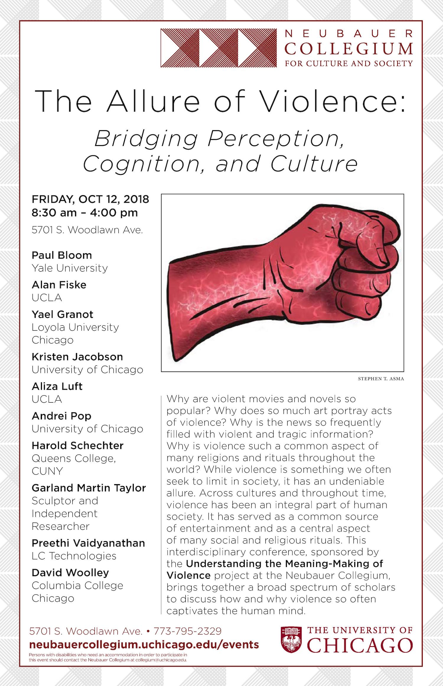
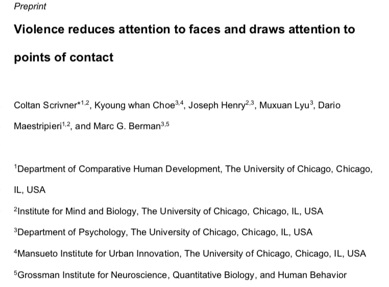

---
authors:
- admin
- Kyoung whan Choe
- Joseph Henry
- Muxuan Lyu
- Dario Maestripieri
- Marc G. Berman
date: "2018-01-01T00:00:00Z"
external_link: "https://neubauercollegium.uchicago.edu/faculty/understanding_the_meaning_making_of_violence_bridging_perception_cognition/"
image:
  caption:
  focal_point: Smart
summary: Why are we captivated by violence?
tags:
- violence
- social cognition
title: The Allure of Violence
weight: 2
url_code: ""
url_pdf: ""
url_slides: ""
url_video: ""
external_link: ""
---

Discussions of violence and initiatives to curb it pervade modern political and social discourses across much of the world. However, there is still a lack of rich, interdisciplinary explanations of how people perceive, process, and make meaning from experiences of violence. While past research has focused on investigating how people understand violent conflicts and how exposure to violence relates to behavioral and life outcomes, virtually no work has been conducted on how visual attention to interpersonal violence relates to interpretation and rationalization of what is being seen. This two-year project utilizes an innovative mixed-methods approach in which we combine eye tracking and verbal descriptions to better understand how people extract and construct meaning from violent social interactions. We are also exploring the role of life experiences, such as exposure to community violence, and individual differences on visual and cognitive biases that occur when viewing violence.

This project is funded by [the Neubauer Collegium for Culture and Society](https://neubauercollegium.uchicago.edu/faculty/understanding_the_meaning_making_of_violence_bridging_perception_cognition/) and is in collaboration with [Marc Berman](https://psychology.uchicago.edu/directory/marc-g-berman), [Kyoung whan Choe](https://voices.uchicago.edu/bermanlab/choe/), [Rick Shweder](https://humdev.uchicago.edu/directory/richard-shweder), [Gabe Velez](https://marquette.academia.edu/GabrielVelez), and [Dario Maestripieri ](http://primate.uchicago.edu/dario-maestripieri.html), 

  
  

## **The Allure of Violence Conference**

To kick off this project, we hosted a conference in which we invited a wide range of scholars, including psychologists, novelists, artists, anthropologists, engineers, and others to discuss the allure of violence. 

- Check out photos from the first part of the day [on the Neubauer Collegium's flickr page for the conference](https://www.flickr.com/photos/neubauercollegium/albums/72157703156661834). 

- The conference even included a live stage-fight! Courtesy of [Fight Master David Woolley and his students](https://www.colum.edu/academics/faculty/david-wooley.html)

  
  

## **Preprint**
You can find the [full-text here](https://www.nature.com/articles/s41598-019-54327-3)

