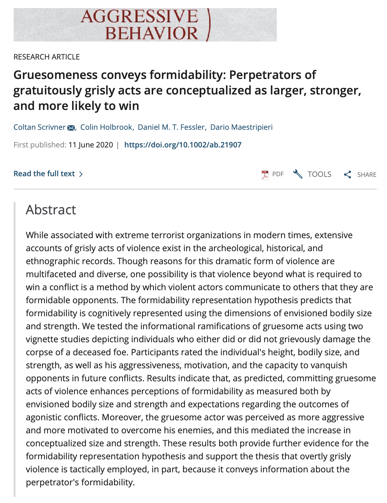

---
authors:
- admin
- Colin Holbrook
- Daniel Fessler
- Dario Maestripieri
date: "2019-01-01T00:00:00Z"
external_link:
image:
  caption: Beheading of St. John the Baptist
  focal_point: Smart
summary: What is the point of gruesome behavior?
tags:
- social cognition
- formidability
- violence
title: Gruesomeness and Perceived Formidability 
weight: 4
url_code: ""
url_pdf: "https://psyarxiv.com/23bqx/"
url_slides: ""
url_video: ""
external_link: ""
---

### What is the point of gruesome behavior?

Impaled. Dismembered. Beheaded. The archeological, historical, and ethnographic records are replete with evidence not only of violence, but of violence that is excessive and overtly grisly. Today, internet searches readily return photos and videos of the acts of terrorist organizations, crime syndicates, and repressive regimes, all of whom not only kill their victims, but conspicuously damage them in a gruesome fashion. These actions appear to be intended to intimidate opponents. In this project we explore 1) the communicative facet of grisly acts, and 2) the thesis that the formidability of a potential antagonist is cognitively represented using the dimensions of bodily size and strength. We examine how observers impute dispositional and motivational attributes on the basis of gruesome acts and demonstrate that representations of relative formidability translate into expectations regarding the outcomes of agonistic conflicts.

  

This project is in collaboration with [Daniel Fessler](http://www.danielmtfessler.com), [Colin Holbrook](http://cholbrook01.bol.ucla.edu), and [Dario Maestripieri](http://primate.uchicago.edu/dario-maestripieri.html).

  
  

## **Manuscript**

The first study from this project was published in [Aggressive Behavior](https://onlinelibrary.wiley.com/doi/abs/10.1002/ab.21907).

You can find a free PDF [here, on PsyArXiv](https://psyarxiv.com/23bqx/)

