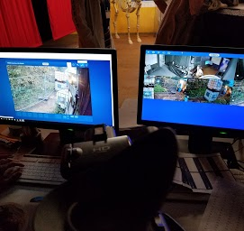

---
authors:
- admin
- Mathias Clasen
- Marc Andersen
- Uffe Schjødt
date: "2017-10-31T00:00:00Z"
external_link:
image:
  caption:
  focal_point: Smart
summary: Why do we play with fear?
tags:
- social cognition
title: Horror, Cognition, and Play 
weight: 4
url_code: ""
url_pdf: ""
url_slides: ""
url_video: ""
external_link: ""
---

Every October, millions of people pay to be scared in haunted houses, or "haunts." On its surface, this is a strange phenomenon. Why do we pay to engage in entertainment that frightens us? We approach this question from the perspective of play. Both imaginative and active, haunts allow people, in this case adults, to bond with others through mechanisms curiously similar to play seen in other areas of human life. In this project we tested the idea that some individuals enjoy the haunt more because they perceive it to be comfortably unpredictable, as opposed to uncomfortably unpredictable (frightening) or predictable (boring). We suspected there would be a sweet spot, so to speak, in scariness that maximizes the perception of the haunt as a form of play. To test this, we used heart rate monitors and trap cameras to monitor enjoyment and anticipation of the scares through physiological measures, facial expressions coded for emotion, and self reported experience. 

- The research was carried out at [Dystopia Haunted House](https://www.facebook.com/DystopiaEntertainment/) while I was a visiting researcher at the [Interacting Minds Centre at Aarhus University](http://interactingminds.au.dk).

- This project was in collaboration with [Mathias Clasen](http://pure.au.dk/portal/en/persons/mathias-clasen(3c9b0961-b1e9-4084-867f-d8b959ba40e5).html), [Marc Andersen](http://pure.au.dk/portal/en/persons/id(67f068d6-a98a-4f2b-840c-53b8855192de).html), and [Uffe Schjødt](http://pure.au.dk/portal/en/us@teo.au.dk)

  
  

## **Here are some photos from the project**

  
 
  

